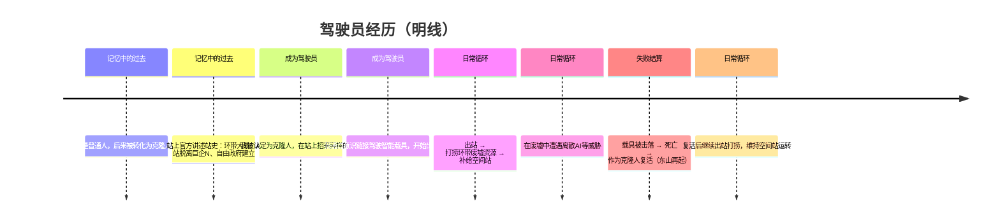

# 明线 · 时间线（驾驶员经历）

> 驾驶员视角的经历时间线：玩家（驾驶员）记得的过去与正在经历的现在。以「待定」标注的条目尚未决议。
> 玩家视角之外的事件（战争进程、势力博弈、真相）见 [暗线·时间线](../02-暗线/暗线·时间线.md)。

---

## 时间线概览

## 记忆中的过去（驾驶员记得的）

| 时间 | 经历 | 状态 |
|------|------|------|
| 过去 | 我「记得」自己**原本是人类**，后来被转化为克隆人——这是我对自己次等身份的「解释」 | 已确认（决议二十；具体情形待定） |
| 过去 | 站上官方讲述的站史：环带曾爆发大战（环带大战），A 站因此部分受损、脱离巨企N，自由政府随后建立 | 已确认（站史叙述口径待定） |
| 过去 | 站上社会依据**来源记录与身份识别**认定我为克隆人 | 已确认（决议二十） |

## 成为驾驶员

| 时间 | 经历 | 状态 |
|------|------|------|
| 现在 | 我作为克隆人在站上生活，被视为次等存在、招来异样的目光 | 已确认（决议十九） |
| 现在 | 我通过意识链接驾驶智能载具，成为 A 站的驾驶员 | 已确认 |

## 日常循环（出站作业）

| 时间 | 经历 | 状态 |
|------|------|------|
| 日常 | 驾驶智能载具出站，在环带废墟中打捞回收物资，补给空间站 | 已确认 |
| 日常 | 透过载具的传感器与视窗看到环带的星空、废墟与残骸 | 已确认 |
| 日常 | 在废墟中遭遇离散AI等威胁 | 已确认（遭遇形式待定） |
| 日常 | 打捞回的物资支撑空间站运转：食物供居民、燃料供载具 | 已确认 |

## 失败结算（载具被击落后）

| 时间 | 经历 | 状态 |
|------|------|------|
| 循环 | 载具被击落 → 驾驶员**死亡** → **作为克隆人被复活**（意识驾驶回传记忆）→ 东山再起 | 已确认（决议二十；「继承债务」是否保留待定） |

相关词条：[驾驶员（玩家）](驾驶员/驾驶员.md) · [智能载具](出站作业/智能载具.md) · [资源系统](出站作业/资源系统.md) · [环带](出站作业/环带.md) · [离散AI](出站作业/离散AI.md) · [自由政府](站内社会/自由政府.md) · [学社](站内社会/学社.md) · [千化教会](站内社会/千化教会.md) · [A 站分裂（站内历史）](站内社会/A站分裂.md)

---

## 明线待定项汇总

- [ ] 玩家记忆中「人类 → 克隆人转化」的具体情形
- [ ] 站上官方如何叙述站史（A 站分裂等背景的叙事口径）
- [ ] 自由政府独裁的具体表现
- [ ] 千化教会的细节设计
- [ ] 智能载具的具体形态、型号与设计
- [ ] 「意识驾驶回传记忆」的技术细节（表层叙事中的克隆人技术如何自圆其说）
- [ ] 战后离散AI的去向
- [ ] 残骸区守军的具体归属
- [ ] 「继承债务」是否保留，与克隆人复活如何衔接

---

**分类：** 时间线 | 明线 | 驾驶员经历
**时代：** 战后（驾驶员当前生活 + 记忆中的过去）
**状态：** 随决议持续更新
