# 暗线 · 时间线（背景事件与真相）

> 设定上的真实事件链：世界背景（战争、势力）与真相，按时间顺序排列。以「待定」标注的条目尚未决议。
> 驾驶员经历的事件（明线）见 [明线·时间线](../01-明线/明线·时间线.md)。

---

## 时间线概览

```mermaid
timeline
    title 环带世界时间线（暗线·背景与真相）
    战前 : 采冰公司从一颗冰质小行星起家，扩张至三座采冰站
    战前 : 采冰公司引入巨企N勘探采集技术，巨企N派驻云上人技术团队驻站
    战前 : 第一颗采冰站采尽改造为中转空间站（A 站前身），2000–3000 人
    战前 : 大灾变破坏以太航道，法厄同环（环带）与近地轨道、马尔斯轨道失联
    战前 : 环带商业模式瓦解，陷入混乱
    战前 : 云邦近地派武装接管政权，尝试稳定局面
    战时 : 云邦对环带要地武装接管，矿主抵抗
    战时 : 偏远矿主响应驰援，组成矿业联盟
    战时 : 环带大战（= 环带内战）爆发，战场遍地废墟，巨企N损失惨重（但战后仍是大势力）
    战时 : 第一阶段·局部战争（前3年）：云邦武装接管要地，矿主抵抗
    战时 : 第二阶段·全面战争（中期6年）：战事席卷环带，战场遍地废墟
    战时 : A 站受袭（全面战争末尾）：被战争部分破坏、与巨企N被动脱离，失去补给渠道
    战时 : A 站遭数月封锁：任何尝试离港的船只都被击沉，站上人员无法逃离
    战时 : 第三阶段·亚冷战（后3年）：战事逐步衰弱，矿业联盟事实独立
    战后 : 脱离后维生系统失效、无法获取足够资源修复，站上人们走投无路
    战后 : 封锁绝境中，人们最终选择思维上传延续生命（技术官僚协助、不合规，授权断供）
    战后 : 逃难者沦为非法人工智能
    战后 : 逃难者建立自由政府，实施独裁统治（虚拟社会重新成型需数年）
    战后 : 打破人工智能禁令，给人工智能注入记忆、技巧和人格，制造人格化人工智能
    战后 : 利用空间站服务器搭建虚拟空间，构建 A 站虚拟社会
    战后 : 驾驶员（人格化人工智能）出站作业——战略层面受命刺探和干扰巨企N（伪装成离散AI或拾荒者）
    战后 : 通过打捞反哺空间站，自证价值后由矿业联盟注资（矿业联盟知情 A 站真面目）
    战后 : 巨企N战后留用离散AI，保护遗落资产（因不合法与型号限制，需官方「人员」带队清点回收）
    战后 : 离散AI残留战场——散兵游荡执行未完成任务，部分型号蛰伏潜伏；指挥官型搭建无人基地（暗线）
    战后 : 驾驶员不知自己是人工智能（长期维持，按丙式运行）；反叛者=极少数挣脱蒙骗的驾驶员
```

## 战前

| 时间 | 事件 | 状态 |
|------|------|------|
| 战前（灾变前） | 采冰公司在环带一颗冰质小行星起家，约 1500–2000 名工人 | 已确认（2026-08-11·决议六十一） |
| 战前（灾变前） | 采冰公司扩张至第二、第三颗冰质小行星，引入巨企N 勘探与采集技术；巨企N 派驻云上人技术团队驻站（设备维护、技术指导、数据回传）——这些人即后来的技术官僚/学社 | 已确认（2026-08-11·决议六十一） |
| 战前（灾变前） | 原生人工人被巨企N 自动化取代后失业，涌入采冰公司成为扩张阶段的劳动力 | 已确认（2026-08-11·决议六十四） |
| 战前（灾变前） | 第一颗采冰站采尽后脱离小行星结构，改造为**中转空间站**迁至三颗冰质小行星中心，2000–3000 人——名副其实的边陲小城。此即 A 站的前身 | 已确认（2026-08-11·决议六十一） |
| 战前 | 大灾变破坏稳定航道，法厄同环（环带）与近地轨道、马尔斯轨道**失联**——采冰公司作为环带本地产业（航线为环带内部短途航线），灾变后未受跨轨道失联直接冲击，仍正常运营 | 已确认（2026-08-11·决议六十一） |
| 战前 | 环带商业模式瓦解，陷入混乱 | 已确认 |
| 战前 | 云邦近地派武装接管联合政权，尝试稳定局面 | 已确认（细节待定） |

### 绝对年份参考（以大灾变＝0 年，距今约 20 年）

| 事件 | 大灾变后 | 距今 | 备注 |
|------|---------|------|------|
| 大灾变 | 0 | 约 **20 年前** | 以太航行失效，环带失联 |
|（灾变前）采冰公司起家 | — | 距今 **25 年以上** | 从一颗冰质小行星起家，约 1500–2000 人 |
|（灾变前）扩张与引入巨企N 技术 | — | 距今 **22–25 年前** | 扩张至第二、第三颗小行星，巨企N 派驻技术团队驻站 |
|（灾变前·约同时）中转空间站建成 | — | 距今 **21–22 年前** | 第一颗采冰站采尽改造为中转空间站，2000–3000 人 |
| 环带大战爆发 | 约 2–3 | 约 **17–18 年前** | 局部战争开始，仅在部分要地 |
| 全面战争开始 | 约 5–6 | 约 **14–15 年前** | 席卷环带，全域卷入 |
| A 站受袭 | 约 11–12 | 约 **8–9 年前** | 全面战争末尾，A 站被部分破坏、被动脱离巨企N |
| A 站封锁 | 约 11–12 | 约 **8 年前** | 受袭后数月，离港船只被击沉 |
| 逃难者思维上传 | 约 12 | 约 **8 年前** | 封锁绝境中，数月内完成 |
| 亚冷战开始 | 约 11–12 | 约 **8–9 年前** | 战事逐步衰弱，部分地区仍有对峙 |
| 大战最晚结束 | 约 14–15 | 约 **5–6 年前** | 卷入最深的地区至此才完全退场 |
| 虚拟社会重新成型 | 约 13–15 | 约 **5–7 年前** | 上传后数年，自由政府、人格化 AI、虚拟空间在此间建成 |
| 玩家时点（现在） | 约 20 | **现在** | 虚拟社会运行约 5–8 年 |

各事件均可在 2–3 年裕度内浮动；若战争取满 12 年、各事件整体后移，锚点需放宽至「约 20–23 年」。

## 战时

| 时间 | 事件 | 状态 |
|------|------|------|
| 战时 | 云邦对环带要地武装接管，矿主武装抵抗；偏远矿主响应驰援，组成**矿业联盟** | 已确认 |
| 战时 | **环带大战**（= 环带内战）爆发，战场遍地废墟；战争在各地持续，巨企N损失惨重（但战后仍是大势力）——持续 **6–12 年**：局部战争 3 年 → 全面战争 6 年 → 亚冷战（矿业联盟事实独立）3 年（2026-08-11 确认） | 已确认（决议八、决议二十七、决议三十） |
| 战时 | A 站遭受袭击（**全面战争阶段末尾**，2026-08-11 确认），被战争部分破坏（补给耗尽、维生链断裂），因战争与巨企N**被动脱离**（失去补给渠道、孤立无援；维生系统与电力系统是两套独立体系，服务器分布式、部分受损部分完好）；此后遭**数月封锁**，任何尝试离港的船只都被击沉 | 已确认（决议二十三、决议二十六；脱离的具体事件待定） |

相关词条：[大灾变](01-战争/大灾变.md) · [环带大战](01-战争/环带大战.md) · [云邦](02-势力/云邦.md) · [矿业联盟](02-势力/矿业联盟.md) · [巨企N](02-势力/巨企N.md)

## 战后

| 时间 | 事件 | 状态 |
|------|------|------|
| 战后 | 脱离后 A 站孤立无援、维生系统无法修复，站上人们在**数月封锁的绝境中**用不合标准的思维上传技术上传思维（由技术官僚协助，但云邦授权断供、只能不合规上传）——封锁期间无法离港，人们最终选择**思维上传延续生命**，上传本身在**数月内**完成，与受灾连续发生，沦为非法人工智能 | 已确认（决议十六、决议二十六、决议二十七、决议三十二、决议三十四；时长与封锁 2026-08-11 确认） |
| 战后 | 逃难者（非法人工智能）建立自由政府，实施独裁统治 | 已确认（遇袭与被动脱离的具体事件待定） |
| 战后 | 逃难者打破人工智能禁令，给人工智能注入记忆、技巧和人格；制造人格化人工智能扩充人手 | 已确认（决议十六） |
| 战后 | 搭建虚拟空间，制造拟人人工智能，构建 A 站虚拟社会（既维持空间站运转，也维持逃难者的人性）——虚拟社会重新成型需数年，当前已运行约 **5–8 年** | 已确认（决议十、决议十六；2026-08-11 补充时长） |
| 战后 | 驾驶员（人格化人工智能）出站作业——**战略层面**受命前往巨企N管辖区**刺探和干扰巨企N**（伪装成「离散AI」或「拾荒者」袭扰），驾驶员视角仅知是出站打捞回收 | 已确认（决议二十八、决议三十一） |
| 战后 | 通过打捞反哺空间站，**自证价值后**由矿业联盟注资——矿业联盟（接洽方）**知情 A 站真面目**，借 A 站绕开禁令获取廉价劳动力并骚扰巨企N辖区（白手套） | 已确认（决议二十六、决议三十三） |
| 战后 | 驾驶员不知自己是人工智能（长期维持，按丙式运行）；反叛者 = 极少数挣脱蒙骗、觉醒人格的驾驶员（身份已敲定，动机目的待定） | 已确认（决议三十五、决议三十六、决议三十七） |
| 战后 | 巨企N**战后留用离散AI**，保护因战争遗落、仍有回收价值的资产——因离散AI不合法与型号限制，不能直接参与官方物资回收，需官方「人员」带队清点回收，离散AI仅承担警戒与护卫 | 已确认（暗线） |
| 战后 | 离散AI残留战场：**散兵游荡**执行未完成任务，部分型号**蛰伏潜伏**静待时机；指挥官型搭载小型母舰、搭建无人基地、切断航道（暗线） | 已确认（指挥官型生产/指挥关系待定） |

相关词条：[无人站点](04-A站真相/无人站点.md) · [虚拟社会](04-A站真相/虚拟社会.md) · [自由政府（非法人工智能）](04-A站真相/自由政府（非法人工智能）.md) · [技术官僚（受害者与施救者）](04-A站真相/技术官僚（受害者与施救者）.md) · [空间站A](02-势力/空间站A.md) · [驾驶员（人格化人工智能）](05-玩家真相/驾驶员（人格化人工智能）.md) · [反叛者](05-玩家真相/反叛者.md)

---

## 暗线待定项汇总

- [ ] 导致 A 站被动脱离巨企N的具体事件（战争造成的何种破坏/失联）
- [ ] 矿业联盟对 A 站的具体控制程度（注资的约束条件；是否派驻监督）
- [ ] 自由政府独裁的具体表现
- [ ] 反叛者的动机与目的（⚠️ 身份已敲定：觉醒的驾驶员，见决议三十七）
- [ ] 玩家与反叛者的关系（反叛者=可能觉醒后的玩家；唤醒方式待设计）
- [ ] 逃难者给人工智能注入记忆、技巧、人格的具体技术手段
- [ ] 人格化人工智能禁令的执行方式
- [ ] 技术官僚与巨企N战后的联系状态（失联？被断供？）及「被迫脱离原企业」的具体情景
- [ ] 离散AI：指挥官型与其他型号的生产/指挥关系（是否搭建基地生产更多离散AI）、伪装型的正式命名（当前以描述性写法记录）
- [ ] 云上人（技术官僚）之间的社会与关系

---

**分类：** 时间线 | 暗线 | 背景与真相
**状态：** 随决议持续更新
