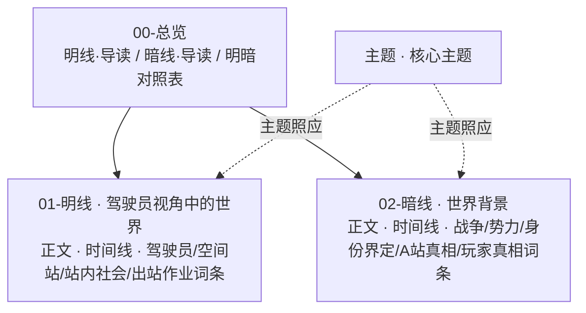

# 设定设计

本板块聚焦于 Spaceship 项目的**世界观与创意设计**，面向叙事策划、美术、程序等团队成员。

---

## 文档库结构

设定文档库采用**明暗线双轨**结构：同一世界有两套平行的描述——**明线**（驾驶员视角中的世界，玩家所见所经历）与 **暗线**（世界背景，玩家视角之外的战争、势力与真相）。两条轨道各自独立成文，词条式分类，末尾标注「分类 / 时代 / 状态」元数据，并通过 **00-总览/明暗对照表** 互链。



```
设定设计/
├── 00-总览/                    ← 双轨入口：导读 + 明暗对照表
│   ├── 明线·总览与导读.md
│   ├── 暗线·总览与导读.md
│   └── 明暗对照表.md
├── 01-明线/                    ← 驾驶员视角中的世界（玩家所见所经历；供剧情/任务/文案引用，不含背景剧透）
│   ├── 明线·正文.md
│   ├── 明线·时间线.md
│   ├── 驾驶员/                 ← 玩家角色本身
│   ├── 空间站/                 ← 驾驶员生活的 A 站
│   ├── 站内社会/               ← 驾驶员在站上接触的群体与站内历史
│   └── 出站作业/               ← 驾驶员驾驶载具出站的一切
├── 02-暗线/                    ← 世界背景（⚠️ 含剧透，仅供叙事/谜题/反转设计，禁止用于玩家可见文案）
│   ├── 暗线·正文.md
│   ├── 暗线·时间线.md
│   ├── 01-战争/                ← 大灾变、环带大战等背景战争
│   ├── 02-势力/                ← 矩阵联合、矿业联盟、巨企N 的势力格局与白手套交易
│   ├── 03-人类身份界定/             ← 核心规则：云上人 vs 人工智能、上传标准、授权、禁令
│   ├── 04-A站真相/              ← 无人站点、虚拟社会、两批人
│   └── 05-玩家真相/             ← 驾驶员真相、克隆人虚构叙事、复活、反叛者
├── 主题/                      ← 跨时段：核心主题
├── 美术风格/                  ← 跨时段：视觉基调、场景、UI、角色、载具风格（总纲/领域规范分层，含待定占位）
└── .草稿/                     ← 草稿归档与决议记录（一切「已确认」的依据）
```

## 双轨导航

| 轨道 | 入口 | 正文 | 时间线 | 用途 |
|------|------|------|--------|------|
| **明线**（驾驶员视角） | [明线·总览与导读](00-总览/明线·总览与导读.md) | [明线·正文](01-明线/明线·正文.md) | [明线·时间线](01-明线/明线·时间线.md) | 剧情、任务、文案写作直接引用 |
| **暗线**（世界背景） | [暗线·总览与导读](00-总览/暗线·总览与导读.md) | [暗线·正文](02-暗线/暗线·正文.md) | [暗线·时间线](02-暗线/暗线·时间线.md) | 设定设计、叙事设计、谜题与反转设计（⚠️ 含剧透） |
| **对照** | [明暗对照表](00-总览/明暗对照表.md) | — | — | 检查矛盾、挖掘张力、检索「玩家以为 X，实际是 Y」 |

### 明线子目录（按领域）

| 目录 | 内容范围 | 典型文档 |
|------|----------|----------|
| [驾驶员](01-明线/驾驶员) | 玩家角色本身：身份、日常、复活 | [驾驶员（玩家）](01-明线/驾驶员/驾驶员.md) |
| [空间站](01-明线/空间站) | 驾驶员生活的 A 站 | [空间站](01-明线/空间站/空间站A.md) |
| [站内社会](01-明线/站内社会) | 驾驶员在站上接触的群体与站内历史 | [自由政府](01-明线/站内社会/自由政府.md) · [学社](01-明线/站内社会/学社.md) · [千化教会](01-明线/站内社会/千化教会.md) · [云上人](01-明线/站内社会/云上人.md) · [A 站分裂](01-明线/站内社会/A站分裂.md) |
| [出站作业](01-明线/出站作业) | 驾驶员驾驶载具出站的一切 | [智能载具](01-明线/出站作业/智能载具.md) · [资源系统](01-明线/出站作业/资源系统.md) · [环带](01-明线/出站作业/环带.md) · [离散AI](01-明线/出站作业/离散AI.md) |

### 暗线子目录（按背景分类）

| 目录 | 内容范围 | 典型文档 |
|------|----------|----------|
| [01-战争](02-暗线/01-战争) | 大灾变、环带大战等背景战争 | [大灾变](02-暗线/01-战争/大灾变.md) · [环带大战](02-暗线/01-战争/环带大战.md) |
| [02-势力](02-暗线/02-势力) | 矩阵联合、矿业联盟、巨企N 的势力格局与白手套交易 | [矩阵联合](02-暗线/02-势力/矩阵联合.md) · [矿业联盟](02-暗线/02-势力/矿业联盟.md) · [巨企N](02-暗线/02-势力/巨企N.md) · [空间站A](02-暗线/02-势力/空间站A.md) |
| [03-人类身份界定](02-暗线/03-人类身份界定) | 贯穿全作的核心规则 | [云上人与人工智能](02-暗线/03-人类身份界定/云上人与人工智能.md) · [思维上传的合法标准](02-暗线/03-人类身份界定/思维上传的合法标准.md) · [矩阵联合官方授权](02-暗线/03-人类身份界定/矩阵联合官方授权.md) · [人格化人工智能禁令](02-暗线/03-人类身份界定/人格化人工智能禁令.md) · [人工智能认知与记忆](02-暗线/03-人类身份界定/人工智能认知与记忆.md) |
| [04-A站真相](02-暗线/04-A站真相) | A 站的真实底细 | [无人站点](02-暗线/04-A站真相/无人站点.md) · [虚拟社会](02-暗线/04-A站真相/虚拟社会.md) · [自由政府（非法人工智能）](02-暗线/04-A站真相/自由政府（非法人工智能）.md) · [技术官僚（受害者与施救者）](02-暗线/04-A站真相/技术官僚（受害者与施救者）.md) · [思维上传与逃难](02-暗线/04-A站真相/思维上传与逃难.md) |
| [05-玩家真相](02-暗线/05-玩家真相) | 驾驶员的真实身份 | [驾驶员（人格化人工智能）](02-暗线/05-玩家真相/驾驶员（人格化人工智能）.md) · [克隆人虚构叙事](02-暗线/05-玩家真相/克隆人虚构叙事.md) · [复活与人工智能备份](02-暗线/05-玩家真相/复活与人工智能备份.md) · [反叛者](02-暗线/05-玩家真相/反叛者.md) |

### 其他

| 目录 | 内容范围 | 典型文档 |
|------|----------|----------|
| [主题](主题) | 跨时段主题 | [核心主题](主题/核心主题.md) |
| [美术风格](美术风格) | 跨时段视觉风格 | [视觉基调与色彩体系](美术风格/00-总纲/视觉基调与色彩体系.md) · [环境与场景风格](美术风格/10-领域规范/环境与场景风格.md) · [UI风格指南](美术风格/10-领域规范/UI风格指南.md) · [角色美术风格](美术风格/10-领域规范/角色美术风格.md) · [飞船与载具美术风格](美术风格/10-领域规范/飞船与载具美术风格.md) · [特效与动态风格（待定）](美术风格/10-领域规范/特效与动态风格.md) · [像素与资产制作规范（待定）](美术风格/20-制作规范/像素与资产制作规范.md) |
| [.草稿](.草稿) | 草稿归档与决议记录 | [世界观草案与深化建议](.草稿/世界观草案与深化建议.md) |

## 明暗线使用约定

1. **写作明线内容**（剧情、任务、NPC 台词、界面文案）时，只引用 [01-明线](01-明线) 与 [明线·总览与导读](00-总览/明线·总览与导读.md)，**避免泄底**——明线只描述驾驶员视角所见，不展开背景与真相。
2. **设计暗线内容**（战争背景、势力内情、反转、谜题、彩蛋、后期剧情）时，引用 [02-暗线](02-暗线) 与 [暗线·总览与导读](00-总览/暗线·总览与导读.md)。
3. **检查矛盾与挖掘张力**时，以 [明暗对照表](00-总览/明暗对照表.md) 为入口，核对同一事物在两线的表述是否自洽。
4. **新增双层设定**时，应在明线、暗线各落一处词条，并在明暗对照表登记一行。
5. **一切「已确认」的依据**：`.草稿/世界观草案与深化建议.md`（含逐字草稿与决议记录）。

---

## 已有参考文档

工程代码库中以下文档可作为本板块的起点资料：

- `Assets/Documentation/SpaceshipPrototype.md` — 当前版本设定摘要
- `Assets/Documentation/SpaceshipVisionPolygonRegionUsage.md` — 视野/照明系统说明（可辅助环境氛围设定）

---

## 设计原则

1. **一致性优先**：所有设定需保持内洽，矛盾之处应及时记录并决议
2. **讲求「能玩」**：设定服务于玩法体验，避免为设定而设定
3. **渐进细化**：允许从框架性描述起步，随开发深入逐层丰富
4. **视觉先行**：关键设定应配合概念草图或参考图，降低沟通成本
5. **可引用可追溯**：重要设定决策需记录理由与讨论结论

---

## 设定词条模板

每个词条建议遵循以下结构：

```
# 词条名

## 概述          — 一句话定义
## 特征          — 分类分点描述（身份/能力/立场等）
## 历史演变      — 按时间顺序（战前/战时/战后）
## 关系          — 与其他词条的交叉引用
## 待定          — 未决议项

---
**分类：** 势力 | 人物 | 事件 | 概念 ...
**时代：** 战前 → 战时 → 战后
**状态：** 存续 / 已结束 / 待定 ...
```
