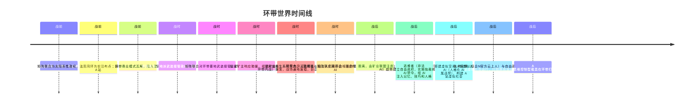

# 总时间线

> 整合所有已确认设定与待定项，按时间顺序排列。以「待定」标注的条目尚未决议。

---

## 时间线概览

## 战前

| 时间 | 事件 | 状态 |
|------|------|------|
| 战前 | 大灾变破坏稳定航道，法厄同环与近地轨道、马尔斯轨道失联 | 已确认（大灾变具体成因待定） |
| 战前 | 矩阵联合为太阳系性政权，法厄同环为前沿布点地带 | 已确认 |
| 战前 | 环带商业模式瓦解，陷入混乱 | 已确认 |
| 战前 | 矩阵联合体系内的巨企N作为「主场势力」支配空间站（A 站） | 已确认（巨企N现为战后背景，见 [巨企N（战后背景）](战后/势力/巨企N.md)） |
| 战前 | 环带作为地理舞台存在 | 已确认 |

相关词条：[大灾变](战前/事件/大灾变.md) · [矩阵联合（前史）](战前/势力/矩阵联合.md) · [环带](战前/概念/环带.md) · [空间站](战前/概念/空间站.md)

## 战时

| 时间 | 事件 | 状态 |
|------|------|------|
| 战时 | 矩阵联合近地派武装接管联合政权，尝试稳定局面 | 已确认（细节待定） |
| 战时 | 矩阵联合对环带要地武装接管，矿主武装抵抗；偏远矿主响应驰援 | 已确认 |
| 战时 | 矿主联合组成矿业联盟，与矩阵联合角力 | 已确认 |
| 战时 | 环带大战（= 环带内战）爆发，战场遍地废墟 | 已确认（决议八：环带大战 = 环带内战） |
| 战时 | 矩阵联合体系内的巨企N损失惨重（具体原因待定） | 已确认（原因待定） |
| 战时 | 空间站维生系统失效、无法获取足够资源修复；站上人们用不合标准的思维上传技术上传思维，沦为非法 AI | 已确认（决议十六；「某些原因」待定） |

相关词条：[矩阵联合（战时）](战时/势力/矩阵联合.md) · [矿业联盟](战时/势力/矿业联盟.md) · [环带大战](战时/事件/环带大战.md) · [思维上传与逃难](战时/事件/思维上传与逃难.md)

## 战后

| 时间 | 事件 | 状态 |
|------|------|------|
| 战后 | 空间站从矩阵联合某巨企（巨企N）名下脱离，由矿业联盟注资，生产廉价无人机打捞清扫残骸区 | 已确认（决议九） |
| 战后 | 逃难者（非法 AI）趁势建立自由政府，实施独裁统治 | 已确认（分裂方式待定） |
| 战后 | 逃难者打破 AI 禁令，给 AI 注入记忆、技巧和人格 | 已确认（决议十六） |
| 战后 | 搭建虚拟空间，制造拟人 AI（人格化 AI 在云上人社会属明令禁止） | 已确认（决议十、决议十六） |
| 战后 | A 站虚拟社会运行（打捞居民 AI 驾驶思维控制型载具在环带打捞资源，实质骚扰残骸区守军） | 已确认 |
| 战后 | 技术官僚（巨企N官方云上人）与自由政府互相钳制 | 已确认 |
| 战后 | 反叛者存在（身份、目的待定） | 已确认存在 |

相关词条：[A 站分裂](战后/事件/A站分裂.md) · [虚拟社会构建](战后/事件/虚拟社会构建.md) · [自由政府](战后/势力/自由政府.md) · [打捞居民 AI](战后/人物/打捞居民AI.md)

---

## 全文待定项汇总

- [ ] 大灾变的具体性质与成因
- [ ] 空间站的具体类型
- [ ] 巨企N损失惨重的具体原因
- [ ] 巨企N具体为矩阵联合体系内哪一家
- [ ] A 站分裂的具体方式
- [ ] 自由政府独裁的具体表现
- [ ] 教会设计
- [ ] 反叛者的身份与目的
- [ ] 玩家与反叛者的关系
- [ ] 特殊返回舱的真实原理
- [ ] 云上人（技术官僚）之间的社会与关系
- [ ] 残骸区守军的具体归属
- [ ] 人格化 AI 禁令的执行方式
- [ ] 「符合规范的协议、加密与配置」由谁制定与认定
- [ ] 技术官僚（巨企N官方云上人）与逃难者（自由政府）的先后关系
- [ ] 「维生系统失效、无法获取足够资源修复」的具体原因
- [ ] 逃难者（非法 AI）给 AI 注入记忆、技巧、人格的具体技术手段

---

**分类：** 时间线 | 索引
**时代：** 战前 → 战时 → 战后
**状态：** 随决议持续更新
