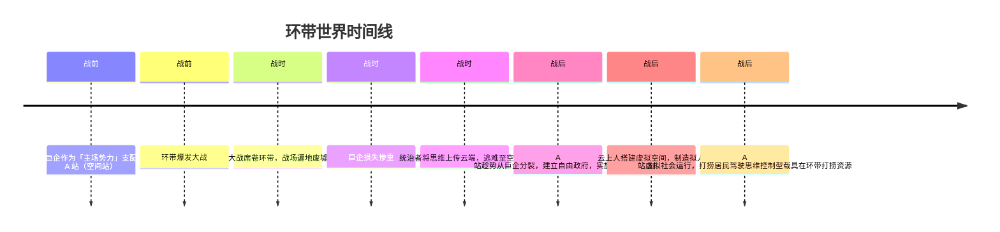

# 总时间线

> 整合所有已确认设定与待定项，按时间顺序排列。以「待定」标注的条目尚未决议。

---

## 时间线概览

## 战前

| 时间 | 事件 | 状态 |
|------|------|------|
| 战前 | 巨企作为「主场势力」支配空间站（A 站） | 已确认 |
| 战前 | 环带作为地理舞台存在 | 已确认 |

相关词条：[巨企](战前/势力/巨企.md) · [环带](战前/概念/环带.md) · [空间站](战前/概念/空间站.md)

## 战时

| 时间 | 事件 | 状态 |
|------|------|------|
| 战时 | 环带爆发大战，战场遍地废墟 | 已确认 |
| 战时 | 巨企损失惨重（具体原因待定） | 已确认（原因待定） |
| 战时 | 统治者将思维上传到云端，逃难至空间站 | 已确认 |

相关词条：[环带大战](战时/事件/环带大战.md) · [思维上传与逃难](战时/事件/思维上传与逃难.md)

## 战后

| 时间 | 事件 | 状态 |
|------|------|------|
| 战后 | A 站趁势从巨企分裂，建立自由政府，实施独裁统治 | 已确认（分裂方式待定） |
| 战后 | 云上人利用空间站服务器搭建虚拟空间，制造拟人 AI | 已确认 |
| 战后 | A 站虚拟社会运行（打捞居民 AI 驾驶思维控制型载具在环带打捞资源） | 已确认 |
| 战后 | 技术官僚与自由政府互相钳制 | 已确认 |
| 战后 | 反叛者存在（身份、目的待定） | 已确认存在 |

相关词条：[A 站分裂](战后/事件/A站分裂.md) · [虚拟社会构建](战后/事件/虚拟社会构建.md) · [自由政府](战后/势力/自由政府.md) · [打捞居民 AI](战后/人物/打捞居民AI.md)

---

## 全文待定项汇总

- [ ] 空间站的具体类型
- [ ] 环带大战的性质与参战方
- [ ] 巨企损失惨重的具体原因
- [ ] 巨企与云上人的关系
- [ ] A 站分裂的具体方式
- [ ] 自由政府独裁的具体表现
- [ ] 教会设计
- [ ] 反叛者的身份与目的
- [ ] 玩家与反叛者的关系
- [ ] 特殊返回舱的真实原理
- [ ] 云上人之间的社会与关系

---

**分类：** 时间线 | 索引
**时代：** 战前 → 战时 → 战后
**状态：** 随决议持续更新
