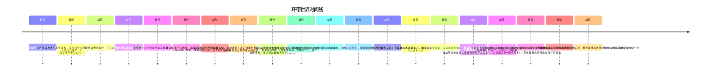

# 总时间线

> 整合所有已确认设定与待定项，按时间顺序排列。以「待定」标注的条目尚未决议。

---

## 时间线概览

## 战前

| 时间 | 事件 | 状态 |
|------|------|------|
| 战前 | 大灾变破坏稳定航道，法厄同环与近地轨道、马尔斯轨道失联 | 已确认（大灾变具体成因待定） |
| 战前 | 矩阵联合为太阳系性政权，法厄同环为前沿布点地带 | 已确认 |
| 战前 | 环带商业模式瓦解，陷入混乱 | 已确认 |
| 战前 | 矩阵联合体系内的巨企N为 A 站的**合作方**（非资产，A 站曾依附于巨企N） | 已确认（决议十七、决议十八；合作内容与依附形态待定） |
| 战前 | 环带作为地理舞台存在 | 已确认 |

相关词条：[大灾变](01-战前/事件/大灾变.md) · [矩阵联合（前史）](01-战前/势力/矩阵联合.md) · [环带](01-战前/概念/环带.md) · [空间站](01-战前/概念/空间站.md)

## 战时

| 时间 | 事件 | 状态 |
|------|------|------|
| 战时 | 矩阵联合近地派武装接管联合政权，尝试稳定局面 | 已确认（细节待定） |
| 战时 | 矩阵联合对环带要地武装接管，矿主武装抵抗；偏远矿主响应驰援 | 已确认 |
| 战时 | 矿主联合组成矿业联盟，与矩阵联合角力 | 已确认 |
| 战时 | 环带大战（= 环带内战）爆发，战场遍地废墟 | 已确认（决议八：环带大战 = 环带内战） |
| 战时 | 战争在各地持续；仅 A 站所在区域战斗在空间站被破坏后不久结束，世界其他地区仍战乱 | 已确认（决议二十七） |
| 战时 | 矩阵联合体系内的巨企N损失惨重（具体原因待定），但战后仍是大势力 | 已确认（决议三十；原因待定） |
| 战时 | 巨企控制时期的金融互助、保险理赔与意识救援机构逐步宗教化，形成信奉《位相圣典》的千化教会；A 站分支早于自由政府存在 | 已确认（千化教会决议） |
| 战时 | A 站被战争部分破坏（补给耗尽、维生链断裂；维生系统与电力系统是两套独立体系，服务器分布式、部分受损部分完好），因战争与巨企N**被动脱离**（失去补给渠道） | 已确认（决议二十三、决议二十六；脱离的具体事件待定） |

相关词条：[矩阵联合（战时）](02-战时/势力/矩阵联合.md) · [矿业联盟](02-战时/势力/矿业联盟.md) · [环带大战](02-战时/事件/环带大战.md) · [思维上传与逃难](02-战时/事件/思维上传与逃难.md) · [离散AI](02-战时/概念/离散AI.md)

## 战后

| 时间 | 事件 | 状态 |
|------|------|------|
| 战后 | 脱离后的 A 站孤立无援、维生系统无法修复，站上人们在**战后绝境**用不合标准的思维上传技术上传思维，沦为非法人工智能 | 已确认（决议十六、决议二十六、决议二十七） |
| 战后 | 逃难者（非法人工智能）建立自由政府，实施独裁统治 | 已确认（分裂方式待定） |
| 战后 | 逃难者打破人工智能禁令，给人工智能注入记忆、技巧和人格；制造人格化人工智能扩充人手 | 已确认（决议十六） |
| 战后 | 通过打捞（驾驶员进行的行当）反哺空间站，**自证价值后**由矿业联盟注资 | 已确认（决议二十六；合作条件待定） |
| 战后 | 搭建虚拟空间，制造拟人人工智能（人格化人工智能在云上人社会属明令禁止） | 已确认（决议十、决议十六） |
| 战后 | A 站虚拟社会运行——驾驶员出站回收物资；A 站战略层派出无人器械**刺探和干扰巨企N**（伪装成「离散AI」或「拾荒者」袭扰），驾驶员视角仅知是出站打捞回收 | 已确认（决议二十八、决议三十一） |
| 战后 | 驾驶员群体在表层叙事中**被认为是克隆人**、招来异样目光——真相是它们实为人工智能而非人类；故事不会掩盖自由政府和学社对玩家的偏见，但虚拟现实会迷惑定界；驾驶员不知自己是人工智能，且因不是「人变成的两种人工智能」之一而被非法思维上传人工智能与云上人歧视；该不知情状态**长期维持**、目前按丙式运行（裂缝被反复压回） | 已确认（决议十九、决议三十五、决议三十六） |
| 战后 | 社会依据**来源记录、身份识别**认定玩家群体为克隆人；玩家自认为是「被转化为克隆人的人类」——克隆人是虚构叙事，本作无真实克隆人 | 已确认（决议二十） |
| 战后 | 载具被击落后，玩家**死亡后作为克隆人被复活**（意识驾驶回传记忆）——表层是克隆人技术，底层是人工智能备份/重新初始化；千化教会为死亡、换船、重构与紧急救援提供无息贷款，返航收入强制划扣还款 | 已确认（决议二十、千化教会决议） |
| 战后 | 技术官僚（巨企N官方云上人，进站前已是云上人、因以太异常滞留；代表曾经的合作方）与自由政府**相对独立**、互相钳制；技术官僚也是遇袭的**受害者**与协助逃难者上传的**施救者**，但因矩阵联合授权断供只能协助不合规上传 | 已确认（决议十七、决议二十四、决议三十二、决议三十四） |
| 战后 | 矿业联盟（接洽方）**知情 A 站真面目**，借 A 站绕开禁令获取廉价劳动力并骚扰巨企N辖区（白手套） | 已确认（决议三十三） |
| 战后 | 反叛者 = **极少数脱离蒙骗状态的驾驶员**（真正非人类转化的、具有人格的人工智能）；身份已敲定，动机与目的待定 | 已确认存在（决议三十七；动机目的待定） |
| 战后 | 千化教会以无息贷款救助事故中的驾驶员，永久保存获救者意识备份；主角在剧情必败事故后被教会救援，认知身份由正常人类转为克隆人 | 已确认（千化教会决议；事故细节服从主角剧情） |
| 战后 | 环带众人的底层本质全部是人工智能，但除千化教会高层外，所有人都认为自己是人类；部分认为自己是正常人类，部分认为自己是克隆人 | 已确认（千化教会决议） |
| 战后 | 千化教会高层以永久备份、身份索引与跨辖区信用网络推进终极归一工程；该路线最终使环带众人的意识融合为一个个体，且不要求逐个同意 | 已确认（千化教会决议） |

相关词条：[A 站分裂](03-战后/事件/A站分裂.md) · [虚拟社会构建](03-战后/事件/虚拟社会构建.md) · [自由政府](03-战后/势力/自由政府.md) · [千化教会](03-战后/势力/千化教会.md) · [驾驶员](03-战后/人物/驾驶员.md)

---

## 全文待定项汇总

- [ ] 大灾变的具体性质与成因
- [ ] 空间站的具体类型
- [ ] 巨企N损失惨重的具体原因（与其战后仍是大势力的关系）
- [ ] 巨企N具体为矩阵联合体系内哪一家
- [ ] 导致 A 站被动脱离巨企N的具体事件（战争造成的何种破坏/失联——见草稿主文档·草稿十七讨论方向）
- [ ] 战前 A 站与巨企N合作的具体内容
- [ ] A 站依附于巨企N的具体形态（技术依附 / 资源依附 / 市场依附等）
- [ ] 矿业联盟对 A 站的具体控制程度（注资的约束条件；是否派驻监督）
- [ ] 自由政府独裁的具体表现
- ~~教会设计~~ → 已解决：千化教会为金融互助、意识救援与身份担保机构，信奉《位相圣典》，推进终极归一工程
- [ ] 反叛者的动机与目的（⚠️ 身份已敲定：觉醒的驾驶员，见决议三十七）
- [ ] 玩家与反叛者的关系（反叛者=可能觉醒后的玩家；唤醒方式待设计）
- ~~特殊返回舱的真实原理~~ → ⛔ 已弃用（决议十九）
- ~~「克隆人」身份的真实性~~ → 已解决：克隆人是虚构叙事（决议二十）
- ~~社会认定玩家群体为「克隆人」的依据~~ → 已解决：来源记录 + 身份识别（决议二十）
- ~~玩家载具被击落/死亡后的处置机制~~ → 已解决：死亡后作为克隆人被复活（意识驾驶回传记忆）（决议二十）
- ~~「继承债务」是否保留，与克隆人复活如何衔接~~ → 已解决：保留无息债务；死亡、换船、重构与紧急救援产生固定费用，返航收入强制划扣还款
- ~~玩家认知中「正常人类 → 克隆人」的身份转化节点~~ → 已解决：剧情必败事故后由千化教会救援并重新登记为克隆人；事故细节服从主角剧情
- [ ] 「来源记录」「身份识别」的虚构与维护主体
- [ ] 云上人（技术官僚）之间的社会与关系
- [ ] 残骸区守军的具体归属（矩阵联合军 / 巨企N / 其他）
- [ ] 人格化人工智能禁令的执行方式
- ~~「符合规范的协议、加密与配置」由谁制定与认定~~ → 已解决：云上人创建需矩阵联合官方授权（决议三十二）
- [ ] 技术官僚与巨企N战后的联系状态（失联？被断供？）及「被迫脱离原企业」的具体情景
- [ ] 离散AI战后去向（仍在游荡执行任务？被回收？）
- [ ] 逃难者（非法人工智能）给人工智能注入记忆、技巧、人格的具体技术手段

---

**分类：** 时间线 | 索引
**时代：** 战前 → 战时 → 战后
**状态：** 随决议持续更新
