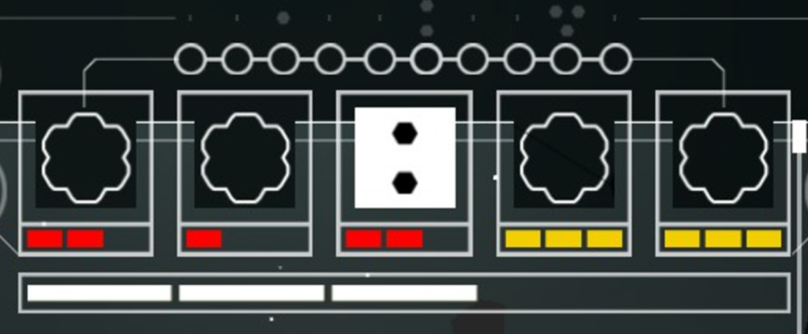
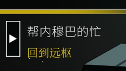

# UI风格指南

## 概述

Spaceship 的 UI 风格服务于一个核心理念:**界面是舰船系统的一部分**。UI 不追求独立于世界的装饰风格,而是与「深空冷调 + 工业金属 + 人工光源」的整体基调同源,界面呈现为驾驶舱内屏幕、仪表与全息面板的延伸。

## 特征

### 1. 设计语言

- **源自世界**:UI 组件(面板、按钮、进度条)以机载屏幕、仪表盘、全息投影的形态出现,避免纯平面 App 风格
- **冷底暖点**:界面底色跟随深空冷调,关键状态与告警使用暖色/警示色点亮,与 [视觉基调与色彩体系](./视觉基调与色彩体系.md) 一致
- **信息优先**:不追求装饰密度,信息层级(当前状态 > 空间信息 > 次要参数)通过亮度、大小与色温区分

### 2. 色彩在 UI 中的使用

| 用途 | 色彩 | 说明 |
|------|------|------|
| 面板/底 | 深灰 / 墨蓝 | 与场景底色衔接,弱化边框感 |
| 主信息 | 冷白 / 科技青 | 常规文字、数值、正常状态 |
| 告警/危险 | 警示红 / 琥珀 | 命中、受损、低资源等关键反馈 |
| 确认/亮点 | 暖橙 | 主操作、选中的强调 |

### 3. 动效原则(待定方向)

- 动效用于「状态反馈」而非「装饰」:响应、确认、告警的反馈感优先
- 避免大幅位移与高刷屏动效,保持局内画面稳定(结合局内场景的沉浸感诉求)

## 参考图与解析

### ui风格参考.png

- **参考点**:界面布局、配色与控件语言的直接示范,给出本项目的 UI 骨架方向
- **状态**:采用
- **理由**:作为 UI 默认方向,后续界面设计以此为基础展开;具体组件规范需从参考中提取形成组件库(见待定)

### ui风格参考？.png

- **参考点**:另一种 UI 风格方向,与上一张并列,方向未定
- **状态**:待决议
- **理由**:文件名带「?」说明未确定;保留作备选方向,与默认方向对比后决策采纳或合并

## 待定

- 是否建立正式 UI 组件库(面板 / 按钮 / 进度条 / 状态图标的规范稿)
- 两种 UI 参考方向(`ui风格参考.png` vs `ui风格参考？.png`)的取舍或融合
- 图标语言:线框式、填充式,或与全息投影风格结合
- UI 动效的具体规范(时长、缓动、反馈范围)

---

**分类：** 美术风格 · UI
**时代：** 跨时段
**状态：** 方向已立,两种参考待决议
