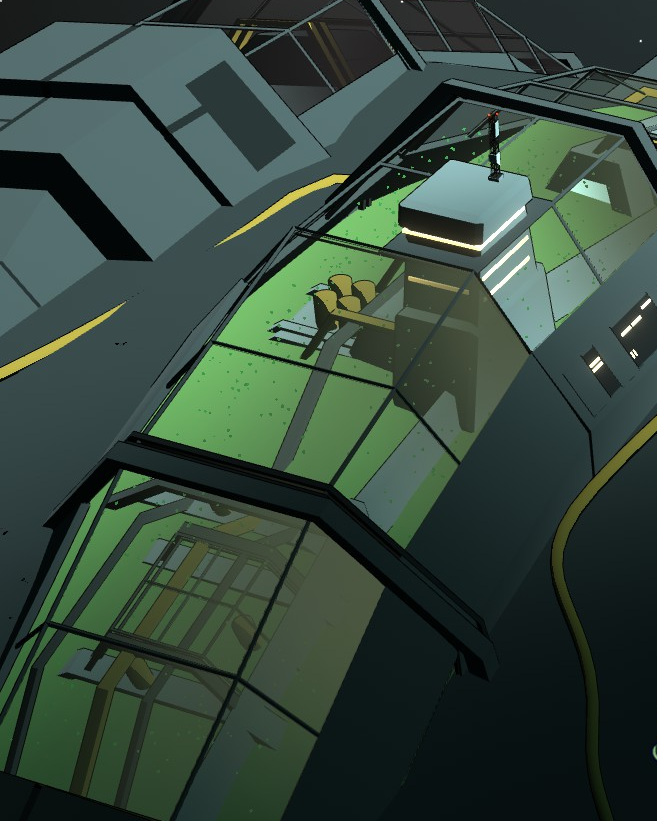
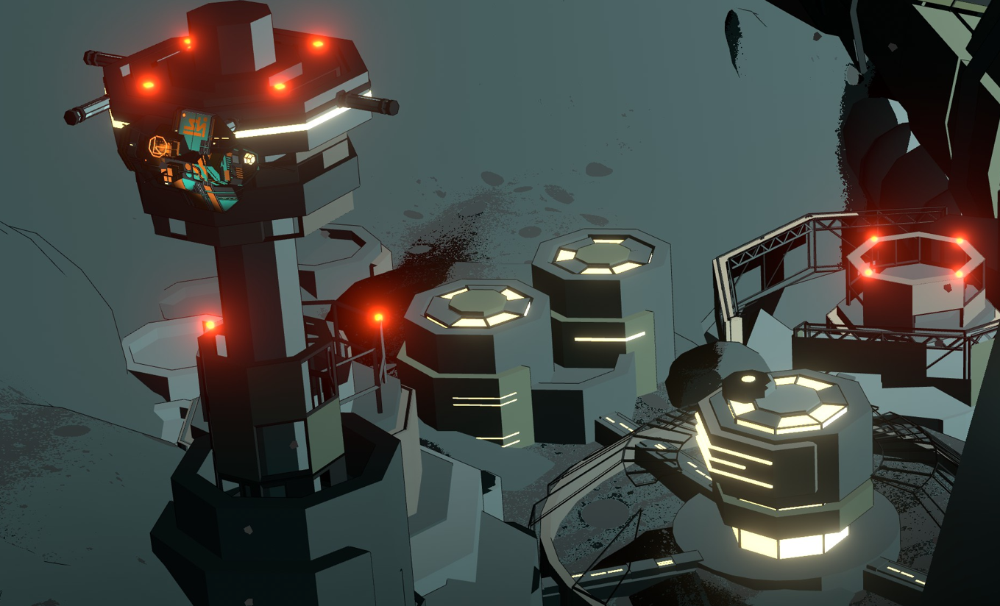
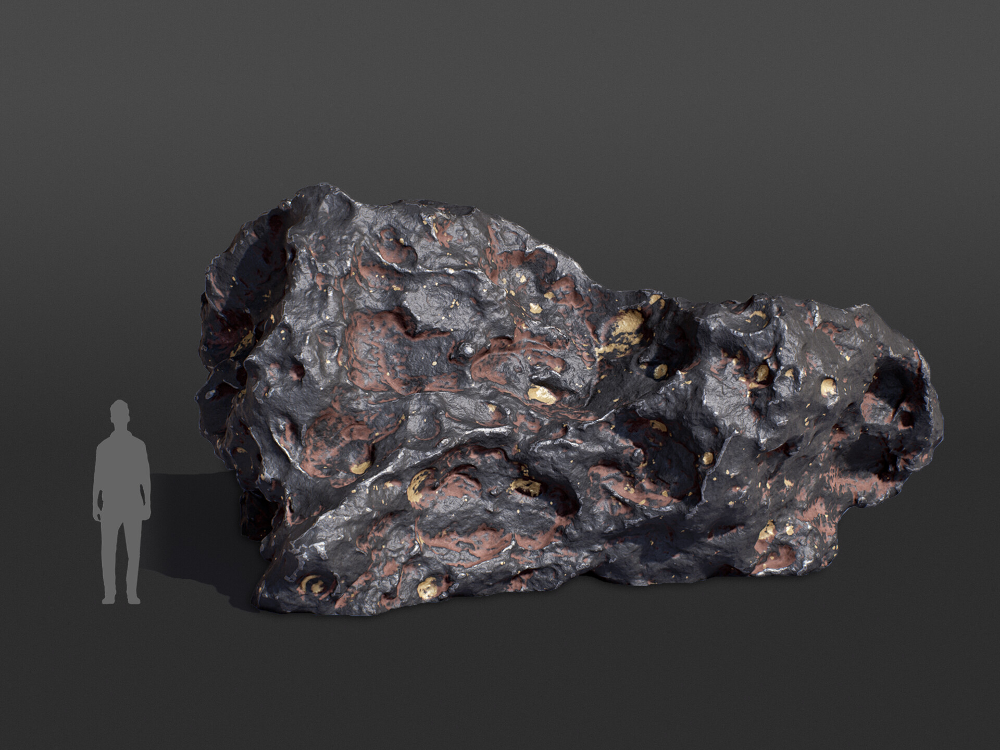

# 环境与场景风格

## 概述

Spaceship 的场景环境分布在**太空港、小行星、环带与局内空间**等几类主要场景。风格基调为**人工工业结构与深空荒寂环境的对比**:人类设施在荒芜的小行星与深空中以金属结构、灯光与机械细节立住存在感。

## 特征

### 1. 场景分类

| 场景 | 关键词 | 参考图 |
|------|--------|--------|
| 太空港 | 大体量、停泊、灯光 | 太空港印象 |
| 小行星据点 | 定居、灯光、人类痕迹 | 小行星上的人类据点 |
| 小行星建筑 | 结构、材质、细节 | 小行星上的建筑 |
| 局内空间 | 玩家主视角、空间感 | 局内空间印象 |

### 2. 通用环境语言

- **结构优先**:场景以桁架、模块舱、管道、支撑结构说话,细节来自结构与机电,而非花纹
- **灯光叙事**:人类活动区域以暖色灯光标记「有人」,荒寂区域以冷光与黑暗标记「无人」——灯光是环境叙事的主要手段
- **尺度对比**:大型结构体(港口、环带)与人类尺度设施并置,强化「人类在宇宙中的渺小」

## 参考图与解析

### 太空港印象.png

- **参考点**:太空港作为核心中转场景的**体量、构型与光照氛围**,特别是大型人工结构如何在深空背景中成立
- **状态**:采用
- **理由**:太空港是剧情与玩法的锚点场景,此图给出「宏伟人工结构」的直接参照;光照与配色遵循 [视觉基调与色彩体系](./视觉基调与色彩体系.md)

### 小行星上的人类据点.png

- **参考点**:小行星表面人类据点的**定居感**——建筑如何锚定在荒芜表面,灯光如何把「据点」从背景中区分出来
- **状态**:采用
- **理由**:小行星据点是与 [环带](../01-战前/概念/环带.md)、矿业相关场景的主要形态,此图定义了「人类痕迹」在荒芜环境中的表现

### 小行星上的建筑.png

- **参考点**:小行星表面建筑群的**结构与材质细节**,以及建筑与地形(岩面)的咬合关系
- **状态**:采用
- **理由**:与上张互为补充:一张看氛围灯光,一张看结构与材质落地

### 局内空间印象.jpg

- **参考点**:游戏局内画面的**空间与光照印象**,是玩家多数时间所处的画面基准
- **状态**:采用
- **理由**:作为局内场景(驾驶、探索)的基调参考,与视觉基调文档中「局内观感」一致

## 不采用参考(反例档案)

以下图片按文件名与目录语境记录为**不采用**,保留在 `image/` 中仅作反例对照,避免未来团队误用。

### 海报里的地球，不宜用作局内背景.jpg

- **原意**:以地球为主题的海报级画面
- **不采用理由**:构图与细节密度属于「宣传海报」级别,**不适合直接用作局内背景**——局内背景需要可读性、性能余量与稳定的光照结构

### 海报里的太空美景，不宜用作局内背景.jpg

- **原意**:太空美景类海报画面
- **不采用理由**:同上一张——海报级美景与局内可玩背景的诉求冲突(信息密度、遮挡、性能)

### 陨石？被大气层灼烧，参考价值低(子目录 4 张)

- **原意**:Jakub Krzyzak 的陨石作品(2 张 + 1 张展示图)与 1 张现实参考
- **不采用理由**:画面重点是**被大气层灼烧**的陨石(火流星),与项目中小行星/陨石的常态观感(冷寂、粗糙岩面)偏离;该目录整体参考价值低
- **保留价值**:可作「大气层内坠落」特殊时刻的画面参考(如大灾变场景),若后续需要再激活

## 待定

- 小行星表面的岩面材质规范(颜色、粗糙度、风化细节)
- 太空港是否需统一视觉组件库(桁架、模块舱、标识系统)供程序侧拼装复用
- 局内空间的可读性要求(亮度下限、对比度规范)待与程序侧视野/照明系统方案对齐

---

**分类：** 美术风格 · 环境与场景
**时代：** 跨时段(战前 → 战时 → 战后)
**状态：** 场景分类已立,细节待细化
