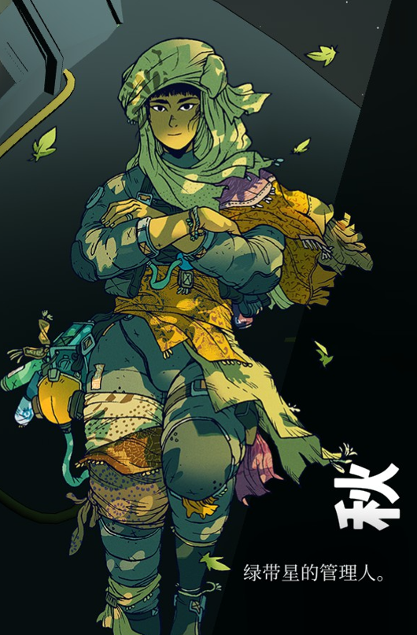

# 角色美术风格

## 概述

Spaceship 的角色以**战后虚拟社会居民(云上人)**与**驾驶员**等为核心。角色美术的核心原则:角色服务于世界观气质,但**风格化优先于写实**——不追求现实质感,而追求与「深空冷调 + 工业人文」基调一致的角色印象。

## 特征

### 1. 角色定位

- **云上人**:战后生活在虚拟社会中的居民。造型不必受现实人体比例与服装逻辑束缚,应呈现「脱离地面、疏离、电子化生存」的气质
- **驾驶员**:承担探索与作战职能,装束偏向机能服、贴身护具,与载具和操作界面产生视觉关联

### 2. 风格化原则

- **风格化 > 写实**:角色参考允许、也鼓励更强烈的造型归纳与特征夸张
- **冷色主调 + 光源点缀**:服饰与肤色倾向冷调,电子设备、光源细节承担暖色与强调色(延续整体配色体系)
- **剪影优先**:角色辨识度首先来自剪影与体态,而非细节贴图

## 参考图与解析

### 人物参考？但我们的云上人应该更风格化一些，不需要考虑太多现实因素.png

- **参考点**:人物角色参考,提供基础的人物造型与气质方向
- **状态**:待决议
- **理由**:文件名已标注方向——**参考可用,但云上人应更风格化,不需考虑现实因素**。此图的价值是气质与轮廓,而非细节写实;具体风格化程度待定义(见待定)

### 人物胸像风格参考（不是我画的）.aseprite

- **参考点**:人物胸像的画风参考,源文件为 Aseprite 工程(`.aseprite`)
- **状态**:待决议
- **理由**:作为画风参考存档;`.aseprite` 为源文件,渲染与协作需通过 Aseprite 打开,团队内如需交流画风宜另导出预览图

## 待定

- 云上人的风格化方向:确定「写实基底下适度归纳」还是「高度风格化(如几何化、扁平色块)」
- 角色肤色与服饰的色相倾向,与冷调世界的衔接方式
- 驾驶员装束与飞船内饰/UI 的视觉一致性规范
- `.aseprite` 源文件是否需要配套预览导出,便于非 Aseprite 用户查看

---

**分类：** 美术风格 · 角色
**时代：** 跨时段(重点为战后)
**状态：** 方向已定,风格化程度待决议
