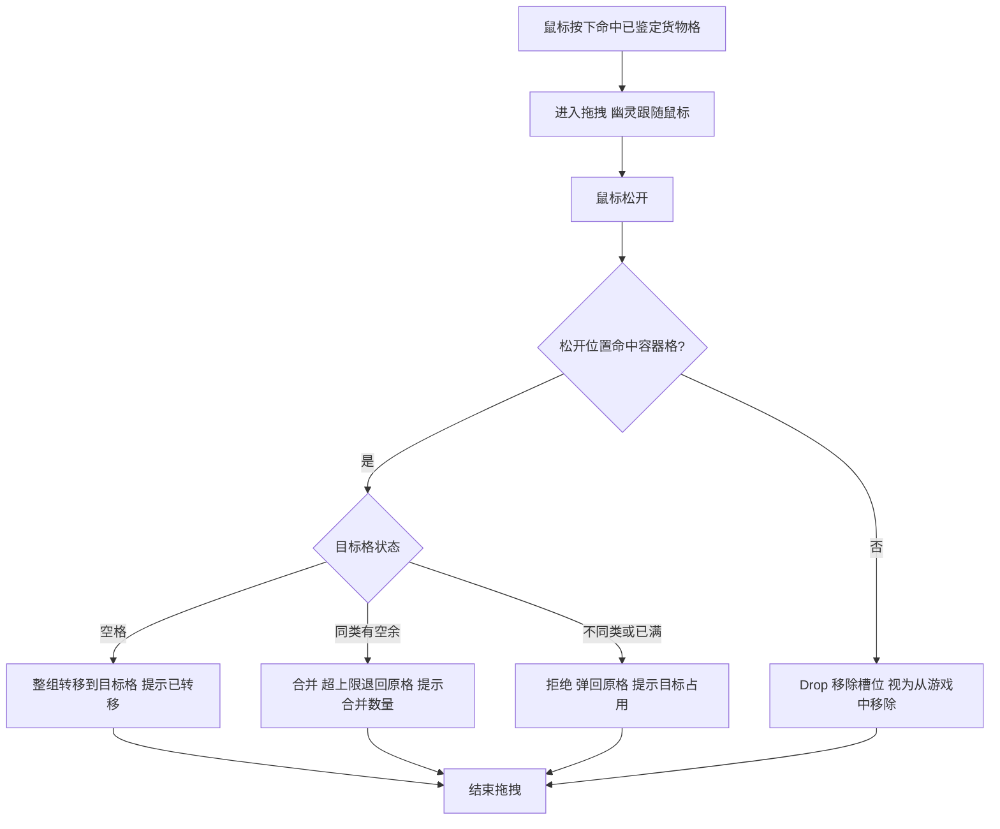

# 仓库整理界面（特性设计）

> 本地设计主本 | 状态：已实现 | 更新：2026-08-02
>
> 对应代码：`Assets/Scripts/UI/CargoOrganizationController.cs`、`Assets/Scripts/Gameplay/Ships/Cargo/ShipCargoHold.cs`、`Assets/Scripts/Gameplay/Ships/Movement/ShipCameraFollower.cs`

---

## 1. 概述

玩家按 Tab 打开仓库整理界面时，游戏不弹任何独立面板，而是**暂停游戏时间、把镜头平滑放大到飞船的储存模块**，物资图标直接显示在**容器格上**，玩家在世界视角里就地拖动物资完成整理。

设计目标：

- 让「仓库」与「飞船」视觉合一，玩家一眼看到物资存放在飞船哪个位置
- 平滑缩放作为一套可复用的摄像机能力，后续其他界面（工坊、维修等）可直接沿用
- 拖拽沿用飞船编辑的交互直觉（按住拖动、半透明幽灵、松开落位）

---

## 2. 触发与退出

| 项目 | 规则 |
|------|------|
| 打开 | 按 Tab；仅在出航状态可用（游戏流程控制 `SetAvailable`） |
| 关闭 | 按 Tab 或 Esc |
| 时间 | 打开时记录当前 `Time.timeScale` 并暂停（置 0）；关闭时恢复 |
| 输入 | 打开期间禁用移动、组装交互与战斗输入 |
| 强制打开 | 取得史诗货物时自动打开并锁定拖拽，进入揭示流程 |

---

## 3. 镜头与呈现

`ShipCameraFollower` 新增组织模式缩放能力：

- **聚焦中心**：所有储存模块包围盒的中心；没有储存模块时退回飞船几何中心
- **聚焦尺寸**：至少容纳储存模块包围盒并留出边距（`organizationPadding`，默认 1.2m），同时不低于 `focusOrthographicSize`（放大上限，默认 3.5）
- **过渡**：开关时按 `focusZoomDuration`（默认 0.6s）平滑插值，使用 `Time.unscaledDeltaTime` 驱动，因此暂停期间动画依然正常播放

呈现方式为 OnGUI 世界坐标投影：每格用模块本地偏移换算世界坐标 → 投影到屏幕 → 绘制格子与图标，格子随镜头缩放、随模块旋转对齐。

| 格位 | SlotIndex | 模块本地偏移 |
|------|-----------|--------------|
| 左上 | 0 | (-0.25, +0.25) |
| 右上 | 1 | (+0.25, +0.25) |
| 左下 | 2 | (-0.25, -0.25) |
| 右下 | 3 | (+0.25, -0.25) |

格位尺寸按每格 0.5m×0.5m 换算屏幕像素；模块为 1m×1m，4 格恰好铺满模块表面。

---

## 4. 界面元素

| 元素 | 位置 | 内容 |
|------|------|------|
| 顶部信息条 | 屏幕顶部中央 | 标题、操作提示、Esc 关闭提示 |
| 容器格 | 各储存模块上 | 空槽占位框、货物图标 + 数量、未鉴定货物问号图 |
| 操作反馈 | 顶部条下方 | 转移/合并/丢弃结果，2.5 秒后消失 |
| 揭示消息 | 屏幕底部中央 | 逐格鉴定进度消息 |
| 悬停提示 | 鼠标旁 | 货物名称、类别、数量 |
| 拖拽幽灵 | 鼠标旁 | 半透明货物图标 + 名称数量 |

---

## 5. 拖拽交互流程

约束：

- 未鉴定货物不可拖动
- 揭示流程中（`IsRevealLocked`）禁止拖动
- 松开位置与原格重合视为无操作
- 命中判定使用「点是否落在旋转矩形内」，与格子的实际旋转对齐

---

## 6. 转移规则（数值）

数据层由 `ShipCargoHold.TransferToSlot` 提供，返回枚举：

| 结果 | 语义 |
|------|------|
| `MovedToEmptySlot` | 整组移动到空槽 |
| `MergedFull` | 全部数量并入同类槽（源格清空） |
| `MergedPartial` | 部分并入，超上限留在原格 |
| `RejectedSlotOccupied` | 目标为不同类型或已满，不做任何改动 |
| `RejectedInvalid` | 源/目标无效，或同格同槽 |

常量：每储存模块 `SlotsPerStorageModule = 4`，每格 `UnitsPerSlot = 10`。

合并规则：目标格 `Matches` 判定同类（具体货物定义或类别兼容）且有空余量时，按 `min(源数量, 目标空余量)` 合并，超出部分退回原格。

---

## 7. 揭示联动

- 史诗货物取得时，`CargoRevealCoordinator` 强制打开界面并设置 `IsRevealLocked`
- 揭示期间禁止拖拽，逐格鉴定消息显示在屏幕底部
- 当前正在揭示的格位高亮描边（`CargoRevealCoordinator.CurrentSlot`）

---

## 8. 边界与异常

| 场景 | 行为 |
|------|------|
| 飞船无储存模块 | 镜头退回几何中心，仍可打开界面，无格子显示 |
| 储存模块被摧毁 | 过滤，不显示其格子 |
| 丢弃时飞船在移动 | 仅移除槽位数据，不生成任何实体 |
| 游戏进入失败/完成状态 | `SetAvailable(false)` 自动关闭界面并恢复时间 |

---

## 9. 扩展点

- 缩放参数当前在 `ShipCameraFollower` 上序列化；如后续需要统一配置，可迁移到 `PlayerShipSettings`
- `TransferToSlot` 的合并规则独立于 UI，未来可在非暂停流程（如拾取自动堆叠）中复用
- 格位布局常量（0.25m 偏移、0.5m 格位）目前与 1m 模块尺寸强绑定；若出现不同尺寸的容器模块，需要将偏移改为从模块数据读取

---

## 10. 验收标准

1. 按 Tab 后镜头平滑放大到储存模块，时间暂停，移动/战斗/组装禁用
2. 每个容器格的物资显示在模块对应位置，随镜头缩放和模块旋转正确对齐
3. 拖到空格完成转移；拖到同类未满格完成合并且超上限退回；拖到异类或已满格被拒绝弹回
4. 拖出容器丢弃，物资直接视为从游戏中移除，不生成任何实体
5. Esc 或再次 Tab 关闭，镜头平滑恢复，时间与输入恢复正常
6. 史诗货物强制打开并逐格鉴定，消息与高亮显示正常
