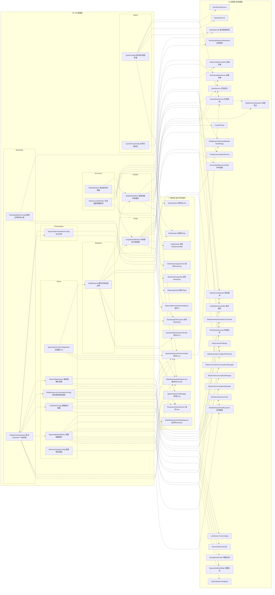

# ScriptableObject 配置 → 运行时数据流

> 16 个 SO 类型 · 8 个命名空间 · 12 个中间持有者 · 40+ 个消费类

---

## 数据流总览



---

## 两大场景分叉

### 探索场景（Expedition）

```
SpaceshipGameConfiguration
  ├─→ SpaceshipGameManager（单例，持有总配置）
  ├─→ TemporaryGameDirector
  │     ├─ WorldRules → ShipAssembly / ShipMotionController / ShipCollisionFeedback
  │     │               / ShipSensorModules / SpaceshipWorldMap / SalvageGenerator / EnemyShipController
  │     └─ ResourceConfig → 三个消耗管理器（燃料 / 食物 / 弹药）
  └─→ SpaceshipGameFlowController
        ├─ PlayerShipSettings → ShipCameraFollower / ShipAssemblyInteractionController
        └─ LinkRulesConfig → LinkRules.FromConfig() → 链接交互控制器 + 锚点视图
```

### 休整站 / 车间场景（RestStop）

```
ShipWorkshopLibrary（聚合 Game SO 副本 + 已保存飞船）
  └─→ ShipWorkshopEditingService
        ├─ WarehouseDefinition → WorkshopWarehouse
        ├─ MinimumSupplyConfig → 借贷补全
        └─ ShipBlueprint → WorkshopEditorSpace / 导出 / 快照恢复

WorkshopEditorConfig → WorkshopEditorSpace
  └─→ WorkshopStructure（拖拽物理 / 边界）
  └─→ WorkshopDepartureResolver（出航物资检查）

ShopSystem → ShopDefinition → ShopService（买卖定价）

QuestSystem → QuestConfig → QuestService → QuestPanel / QuestEventSource
```

---

## 存档路径

```
GameSaveService（Core/）管理 SaveData
  ├─ 金币 / 欠账
  ├─ 任务状态（QuestSaveEntry.questId）
  ├─ 模块库存
  ├─ 货物库存
  └─ 仓库库存 / 货架库存

写入时机：SpaceshipGameFlowController → 失败时 / 结算时合并入仓库
跨场景传递：ShipRuntimeSnapshot → 飞船状态（货物快照）
```

---

## 跨命名空间引用

| 引用路径 | 说明 |
|---|---|
| `SpaceshipGameConfiguration` → `ShipBlueprint` | 玩家基础飞船蓝图 |
| `ShopDefinition` → `CargoItemDefinition`、`ModuleDefinition` | 商品条目指向货物/模块定义 |
| `ShipBlueprint` → `CargoItemDefinition`、`ModuleDefinition` | 蓝图内初始货物和模块布局 |
| `ShipWorkshopLibrary` → Game 全部 SO + `ShipBlueprint` 列表 | 车间资料库聚合 |
| `WorkshopEditorConfig` → `LinkRulesConfig` | 车间版链接规则独立副本 |

---

## 统计

| 指标 | 数值 |
|---|---|
| ScriptableObject 类型 | 16 个 |
| 命名空间 | 8 个 |
| 中间持有者（组件 / 服务 / 单例） | 12 个 |
| 运行时消费类 | 40+ 个 |
