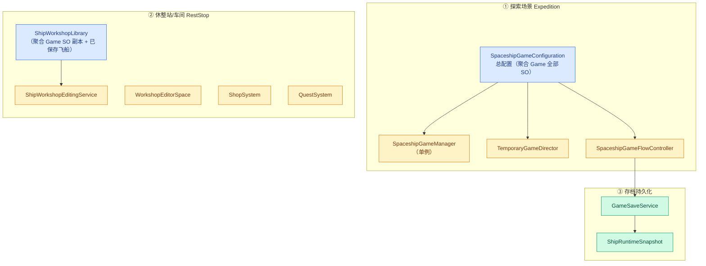
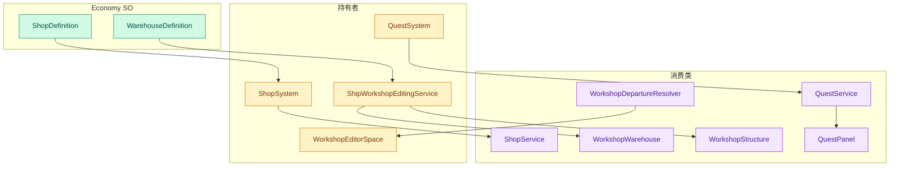
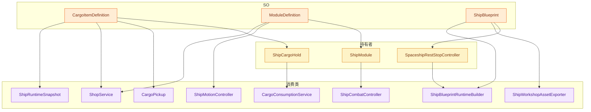
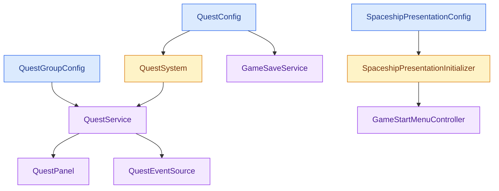
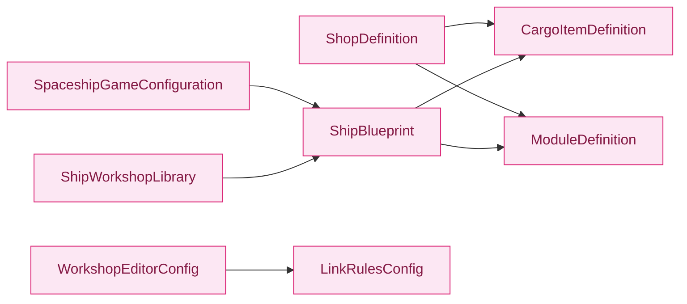
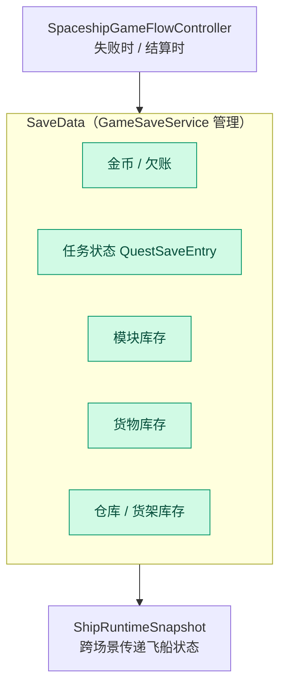

# ScriptableObject 配置 → 运行时数据流

> 16 个 SO 类型 · 8 个命名空间 · 12 个中间持有者 · 40+ 个消费类
> 数据流分两大场景：探索（Expedition）与休整站/车间（RestStop）

---

## 一、总览

---

## 二、探索场景：SO → 消费类

```mermaid
flowchart TB
    subgraph GW["Game 命名空间 SO"]
        WRL["SpaceshipWorldRules"]
        RES["ShipResourceConsumptionConfig"]
        SET["PlayerShipSettings"]
        LNK["LinkRulesConfig"]
    end

    subgraph C1["世界物理 / 地图"]
        A1["ShipAssembly.ConfigurePhysics"]
        A2["ShipMotionController"]
        A3["ShipCollisionFeedback"]
        A4["ShipSensorModules"]
        A5["SpaceshipWorldMap"]
        A6["SalvageGenerator"]
        A7["EnemyShipController"]
    end

    subgraph C2["消耗管理"]
        B1["ShipFuelConsumptionManager"]
        B2["ShipFoodConsumptionManager"]
        B3["ShipAmmunitionConsumptionManager"]
    end

    subgraph C3["操控 / 摄像机"]
        D1["ShipCameraFollower"]
        D2["ShipAssemblyInteractionController"]
    end

    subgraph C4["链接规则"]
        E1["LinkRules.FromConfig"]
        E2["WorkshopStructure"]
        E3["ModuleLinkAnchorView"]
    end

    WRL --> A1 & A2 & A3 & A4 & A5 & A6 & A7
    RES --> B1 & B2 & B3
    SET --> D1 & D2
    LNK --> E1 & E2 & E3

    classDef so fill:#dbeafe,stroke:#2563eb,color:#1e3a8a;
    classDef con fill:#f3e8ff,stroke:#9333ea,color:#4c1d95;
    class WRL,RES,SET,LNK so;
    class A1,A2,A3,A4,A5,A6,A7,B1,B2,B3,D1,D2,E1,E2,E3 con;
```

---

## 三、休整站/车间场景

---

## 四、货物 / 模块 / 蓝图

---

## 五、任务 / 表现

---

## 跨命名空间引用

---

## 存档 / 恢复路径

---

## 统计

| 指标 | 数值 |
|---|---|
| ScriptableObject 类型 | 16 个 |
| 命名空间 | 8 个 |
| 中间持有者（组件 / 服务 / 单例） | 12 个 |
| 运行时消费类 | 40+ 个 |
